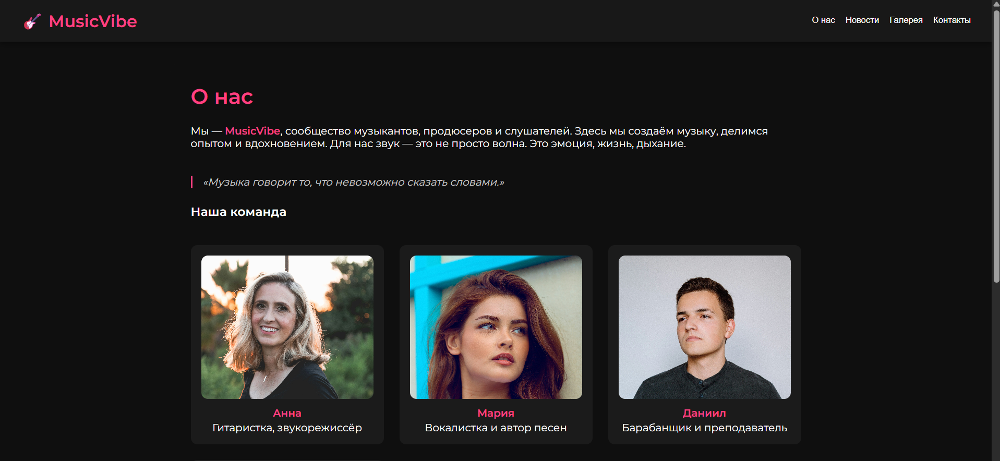
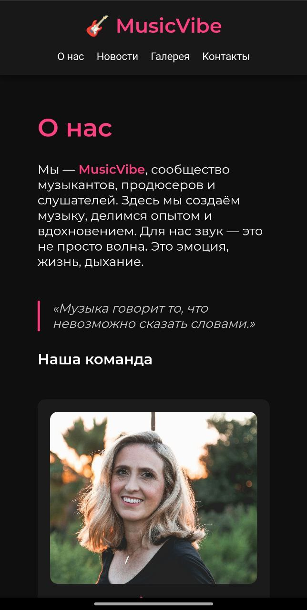

# 🧩 Лабораторная работа №2  
**Тема:** Создание адаптивного сайта с использованием Flexbox и CSS Grid  

---

## 📄 Описание работы  
В рамках лабораторной работы был создан сайт для музыкальной группы.  
Проект включает несколько страниц:  
- **Главная** — общая информация и новости.  
- **О нас** — описание участников и философии группы.  
- **Галерея** — фотографии с выступлений.  
- **Контакты** — контактные данные участников команды.  

Сайт оформлен с использованием **семантических тегов**, **Flexbox** и **Grid**.  
Добавлены **медиазапросы**, чтобы страница корректно отображалась на мобильных устройствах.  

---

## 🖼️ Скриншоты  
### 💻 Версия для компьютера  

### 📱 Версия для мобильных устройств  

---

## 🧠 Ответы на вопросы

### 1. Какие семантические теги вы использовали?  
Использованы теги:  
`<header>`, `<nav>`, `<main>`, `<section>`, `<article>`, `<footer>` — для логичного разделения структуры страницы и повышения читаемости кода.

---

### 2. Где использовали flexbox, а где grid?  
- **Flexbox** — применён для выравнивания элементов навигации и расположения карточек участников.  
- **Grid** — использован для галереи изображений и основной контентной сетки сайта.

---

### 3. Какой медиазапрос добавили и что он меняет?  
Добавлен медиазапрос `@media (max-width: 768px)`, который:  
- Меняет расположение элементов с горизонтального на вертикальное.  
- Центрирует контент.  
- Делает навигацию, галерею и карточки участников адаптивными.

---

### 4. Где помог ИИ, а что пришлось дорабатывать вручную?

**ИИ помог:**
- Подсказал общую структуру проекта и дал рекомендации по использованию семантических тегов.  
- Объяснил, как реализовать адаптивность через медиазапросы.  
- Помог разобраться с некоторыми моментами по flex и grid.  

**Вручную было сделано:**
- Создан и доработан CSS-файл: добавлены собственные цвета, шрифты и отступы.  
- Настроена сетка через flex и grid, реализована адаптивность под разные экраны.  
- Подключены изображения и проверено отображение сайта на телефоне и компьютере.  
- Настроен проект на GitHub Pages и загружен репозиторий.  
- Добавлены скриншоты версии для компьютера и мобильных устройств в папку проекта.  

